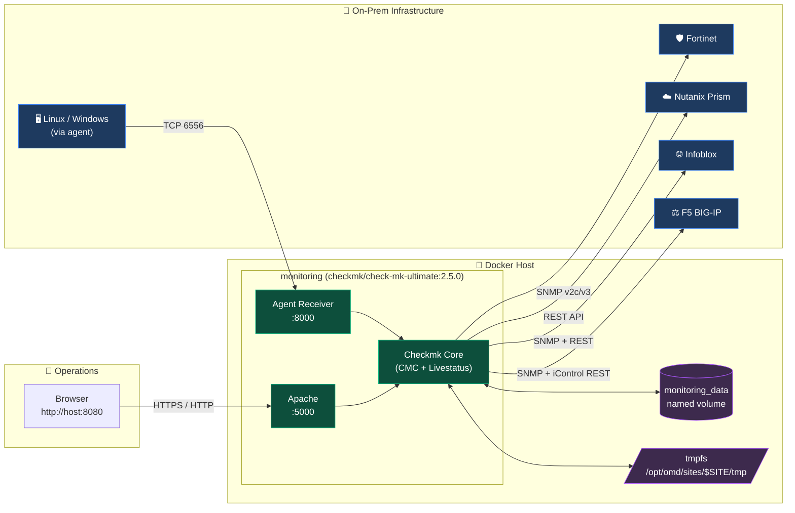
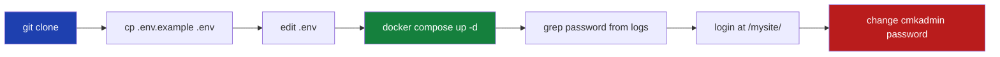
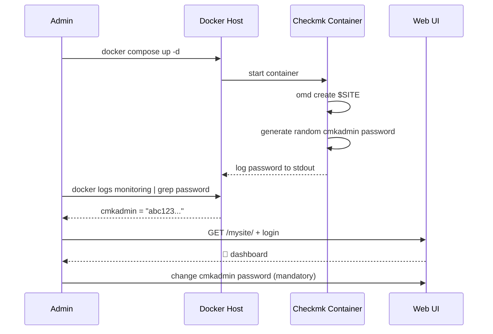
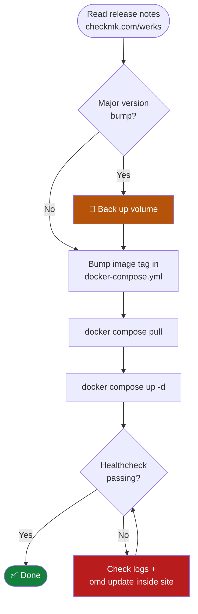

<div align="center">

# 🧩 Checkmk Monitoring Stack

### Production-ready Docker deployment for monitoring on-prem infrastructure

[](https://www.docker.com/)
[](https://checkmk.com/)
[](LICENSE)
[](https://github.com/amrmarey/checkmk/issues)
[](#-contributing)
[](#-credits)

**Monitor Fortinet · Nutanix · Infoblox · F5 — and everything else — from a single container.**

</div>

---

## ⚡ Quick Start

```bash
git clone https://github.com/amrmarey/checkmk.git
cd checkmk
cp .env.example .env          # edit values to taste
docker compose up -d
docker logs monitoring 2>&1 | grep -i password   # grab the cmkadmin password
```

Then open **http://localhost:8080/mysite/** and log in as `cmkadmin`.

---

## 🧭 Table of Contents

- [🌐 Overview](#-overview)
- [🏗️ Architecture](#️-architecture)
- [📡 What This Monitors](#-what-this-monitors)
- [🧰 Prerequisites](#-prerequisites)
- [🚀 Installation](#-installation)
- [🔧 Configuration](#-configuration)
- [🔐 First Login](#-first-login)
- [🖥️ Daily Usage](#️-daily-usage)
- [🔄 Upgrading Checkmk](#-upgrading-checkmk)
- [💾 Backup & Restore](#-backup--restore)
- [🩺 Troubleshooting](#-troubleshooting)
- [🤝 Contributing](#-contributing)
- [📄 License](#-license)
- [📬 Contact](#-contact)
- [🤖 Credits](#-credits)

---

## 🌐 Overview

**Checkmk** is an open-core IT monitoring platform that observes servers, network gear, hypervisors, applications, and cloud workloads from a single pane of glass. This repository ships an opinionated **Docker Compose** deployment of **Checkmk Ultimate 2.5.0** — pinned, reproducible, and ready for hardware-heavy on-prem environments.

> 💡 **Edition note:** `check-mk-ultimate` is the renamed `check-mk-cloud` edition starting with the Checkmk 2.4+ release line. It bundles every premium feature, including vendor-specific special agents (Nutanix Prism, F5 iControl, Fortinet enhanced checks).

---

## 🏗️ Architecture



**Key flows:**

- 🔵 Operators reach the Checkmk UI on `:5000` (mapped to host `:8080`).
- 🟢 Active checks (Checkmk Core → device) handle SNMP/REST polling for appliances.
- 🟡 Passive checks (agent → receiver `:8000`) carry data from servers running the Checkmk agent.
- 🟣 Persistent state lives on the `monitoring_data` volume; runtime scratch lives in tmpfs.

---

## 📡 What This Monitors

This stack is tuned for the typical hybrid on-prem datacenter. Vendor coverage in the **Ultimate** edition:

| Vendor / Platform     | Protocol                  | Special Agent      | Notes                                                                  |
| --------------------- | ------------------------- | ------------------ | ---------------------------------------------------------------------- |
| 🛡️ **Fortinet** (FortiGate, FortiSwitch, FortiAnalyzer) | SNMP v2c/v3        | `agent_fortigate`  | Sessions, VPN tunnels, HA cluster, interface stats, license expiry.    |
| ☁️ **Nutanix** Prism Element/Central                    | HTTPS REST API     | `agent_prism`      | Cluster health, container utilization, VM state, alert ingestion.      |
| 🌐 **Infoblox** Grid, DDI                                | SNMP + WAPI REST   | `agent_infoblox`   | Grid replication, DHCP pool usage, DNS query rates, license usage.     |
| ⚖️ **F5** BIG-IP (LTM, GTM, ASM)                         | SNMP + iControl REST | `agent_f5_bigip` | Pool/member state, virtual server traffic, SSL cert expiry, sync state. |
| 🖥️ **Linux / Windows / *BSD** servers                    | Native agent (TCP 6556) | n/a              | CPU, memory, filesystems, processes, services, custom plugins.         |

> 📦 All four vendor integrations ship in the box with the Ultimate edition — no extra license keys required.

---

## 🧰 Prerequisites

| Requirement       | Minimum            | Recommended         |
| ----------------- | ------------------ | ------------------- |
| Docker Engine     | `20.10+`           | `24.0+`             |
| Docker Compose    | `v2.x` (plugin)    | latest              |
| RAM               | `4 GB`             | `8 GB+`             |
| CPU               | `2 cores`          | `4 cores+`          |
| Disk              | `20 GB`            | `100 GB+` (history) |
| OS                | Linux / Windows / macOS host with Docker | Linux server |

---

## 🚀 Installation



**Step by step:**

1. **Clone the repository**

   ```bash
   git clone https://github.com/amrmarey/checkmk.git
   cd checkmk
   ```

2. **Create your `.env` file**

   ```bash
   cp .env.example .env
   ```

   Edit `.env` and adjust the values (see [Configuration](#-configuration)). The `.env` file is gitignored — never commit it.

3. **Start the container**

   ```bash
   docker compose up -d
   ```

4. **Open the Web UI**

   Navigate to `http://localhost:8080/mysite/` (replace `mysite` with your `CMK_SITE_ID`).

---

## 🔧 Configuration

All runtime configuration lives in `.env`:

| Variable                | Purpose                                                             | Default    |
| ----------------------- | ------------------------------------------------------------------- | ---------- |
| `CHECKMK_PORT`          | Host port mapped to the Checkmk web UI (container port `5000`).     | `8080`     |
| `CHECKMK_REGISTER_PORT` | Host port mapped to the agent receiver (container port `8000`).     | `8000`     |
| `CMK_SITE_ID`           | OMD site name. Becomes the URL path segment and tmpfs mount path.   | `mysite`   |
| `CMK_USERNAME`          | Documentary only — not read by the container (admin is `cmkadmin`). | `cmkadmin` |
| `CMK_PASSWORD`          | Optional. Sets the initial `cmkadmin` password on first boot.       | *random*   |

> ⚠️ `CMK_SITE_ID` must match the `tmpfs` mount path in `docker-compose.yml`. The compose file already templates this for you, but if you customize the mount path manually, keep both in sync.

---

## 🔐 First Login



If you did **not** set `CMK_PASSWORD` in `.env`, retrieve the auto-generated one:

```bash
docker logs monitoring 2>&1 | grep -i "password"
```

Log in at `http://localhost:8080/${CMK_SITE_ID}/` with username `cmkadmin`. **Change the password immediately after first login.**

---

## 🖥️ Daily Usage

After the site is up, the typical workflow is:

- 🧩 **Add hosts & services** — `Setup → Hosts → Add host`. Use SNMP for appliances, the Checkmk agent for servers.
- 🔌 **Configure special agents** — `Setup → Agents → Other integrations` for Nutanix Prism, F5 iControl, Infoblox WAPI, etc.
- ⚡ **Set up notifications** — `Setup → Events → Notifications` for email, Slack, PagerDuty, MS Teams, webhooks.
- 📊 **Build dashboards** — `Customize → Dashboards` for tailored NOC views.
- 🔁 **Activate changes** after every config edit (top-right yellow banner).

Quick shell snippets:

```bash
docker ps                                  # show the monitoring container
docker exec -it monitoring omd status      # service-level health
docker exec -it -u mysite monitoring bash  # drop into the site shell
```

---

## 🔄 Upgrading Checkmk



The image is pinned in `docker-compose.yml` for reproducibility. To upgrade:

1. Check [checkmk.com/werks](https://checkmk.com/werks) and [checkmk.com/download](https://checkmk.com/download) for the latest patch and any breaking changes.
2. Update the `image:` tag in `docker-compose.yml`.
3. Pull and recreate:

   ```bash
   docker compose pull
   docker compose up -d
   ```

> ⚠️ Site data persists in the `monitoring_data` volume across restarts and image upgrades. **Always back up before a major version bump** (e.g. `2.4 → 2.5`) — major bumps may run `omd update` against the persisted site, which is hard to roll back.

---

## 💾 Backup & Restore

<details>
<summary><b>📦 Snapshot the named volume</b></summary>

```bash
docker run --rm \
  -v checkmk_monitoring_data:/data \
  -v "$PWD":/backup \
  alpine tar czf /backup/checkmk-backup-$(date +%F).tar.gz -C /data .
```

</details>

<details>
<summary><b>♻️ Restore from a snapshot</b></summary>

```bash
docker compose down
docker volume rm checkmk_monitoring_data
docker volume create checkmk_monitoring_data
docker run --rm \
  -v checkmk_monitoring_data:/data \
  -v "$PWD":/backup \
  alpine sh -c "cd /data && tar xzf /backup/checkmk-backup-YYYY-MM-DD.tar.gz"
docker compose up -d
```

</details>

<details>
<summary><b>🛠️ Use the built-in OMD backup tool</b></summary>

For a Checkmk-aware backup that excludes runtime caches:

```bash
docker exec -u mysite monitoring omd backup /omd/sites/mysite/var/backup.tar.gz
docker cp monitoring:/omd/sites/mysite/var/backup.tar.gz ./checkmk-omd-backup.tar.gz
```

</details>

---

## 🩺 Troubleshooting

<details>
<summary><b>🔴 Container restarts in a loop</b></summary>

Check logs first:

```bash
docker logs --tail 200 monitoring
```

Common cause: `CMK_SITE_ID` in `.env` doesn't match the tmpfs mount path, or the named volume contains a site with a different name. Either align names or recreate the volume.

</details>

<details>
<summary><b>🟡 Healthcheck stuck in <code>starting</code></b></summary>

Checkmk needs ~60–120 s on first boot. The compose file allows `start_period: 2m`. If it persists, drop in and check OMD directly:

```bash
docker exec -it monitoring omd status mysite
```

</details>

<details>
<summary><b>🔑 Lost the cmkadmin password</b></summary>

Reset it from inside the container:

```bash
docker exec -it -u mysite monitoring cmk-passwd cmkadmin
```

</details>

<details>
<summary><b>🌐 Can't reach the UI on <code>:8080</code></b></summary>

- Confirm the host port: `docker ps` should show `0.0.0.0:8080->5000/tcp`.
- Remember the URL needs the site path: `http://host:8080/<CMK_SITE_ID>/`, *not* the bare root.
- On Windows/macOS Docker Desktop, ensure the port isn't blocked by another service.

</details>

---

## 🤝 Contributing

Contributions are welcome and appreciated 💪

1. **Fork** this repository
2. **Create a branch**: `git checkout -b feature/your-feature`
3. **Commit** your changes with a descriptive message
4. **Push** to your fork: `git push origin feature/your-feature`
5. **Open a Pull Request**

For larger changes, please [open an issue](https://github.com/amrmarey/checkmk/issues) first to discuss the approach.

---

## 📄 License

This project is distributed under the [MIT License](LICENSE) — free to use, modify, and distribute with attribution.

---

## 📬 Contact

<div align="center">

👤 **Amr Marey** · [✉️ amr.marey@msn.com](mailto:amr.marey@msn.com) · [🐙 GitHub](https://github.com/amrmarey)

📧 Questions, feedback, or issues? [Open a GitHub issue](https://github.com/amrmarey/checkmk/issues).

</div>

---

## 🤖 Credits

> *Some of the scaffolding, prose polish, and Mermaid diagrams in this repo were drafted with AI assistance (Anthropic's Claude). Architecture choices, edition selection, and the overall direction are mine — the code is reviewed, tested, and shipped by a human.*
>
> **Vibes by [@amrmarey](https://github.com/amrmarey).** 🎧

<div align="center">

⭐ **If this helped you, give the repo a star — it helps others discover the project.** 💙

</div>
